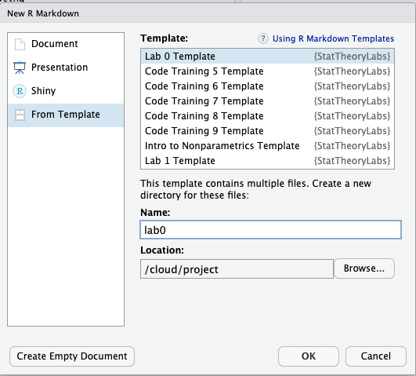
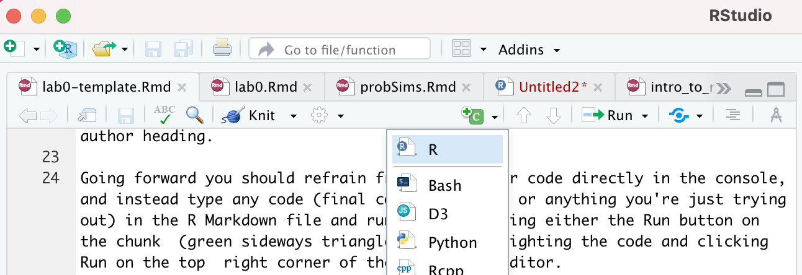
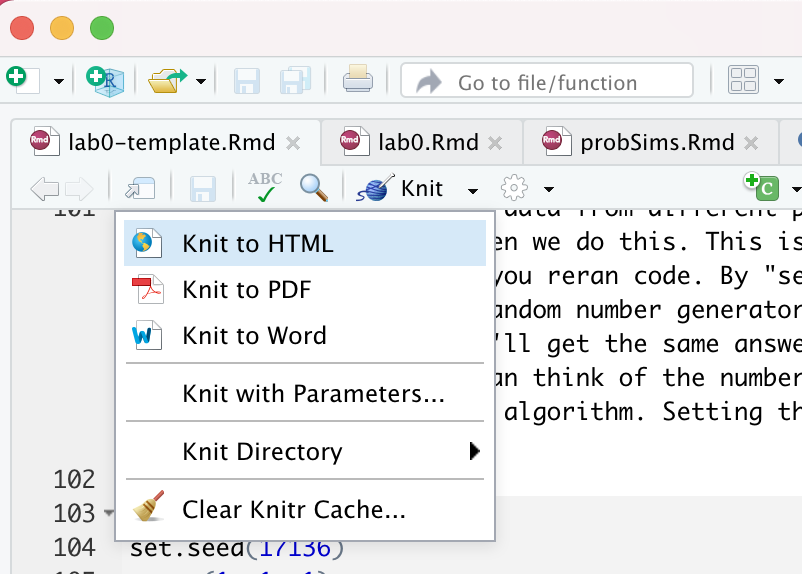
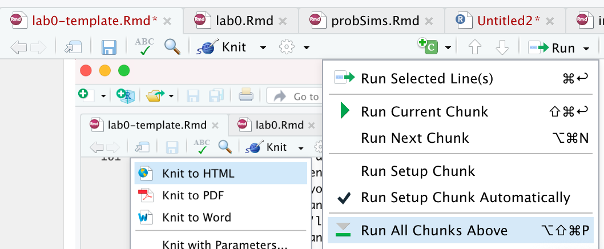

```{r setup, include=FALSE}
knitr::opts_chunk$set(echo = TRUE)
```

## Creating a reproducible lab report

We will be using R Markdown to create reproducible lab reports. See the following videos describing why and how. 

[**Why use R Markdown for Lab Reports?**](https://youtu.be/lNWVQ2oxNho)


[**Using R Markdown for Lab Reports in RStudio**](https://youtu.be/o0h-eVABe9M)

We will *not* be using the templates that the video references. Instead, we will start either start from scratch or use a template from the `StatTheoryLabs` package (see below).



In RStudio, if you want to create a new file from scratch, go to New File -> R Markdown. Often, I will give you a template that you can add to. Be sure to add your name to the author heading.

Going forward you should refrain from typing your code directly in the console, and instead type any code (final correct answer, or anything you're just trying out) in the R Markdown file and run the chunk using either the Run button on the chunk  (green sideways triangle) or by highlighting the code and clicking Run on the top  right corner of the R Markdown editor. 

If at any point you need to start over, you can Run All Chunks above the chunk you're working in by clicking on the down arrow in the code chunk.

## Code Chunks 

This is a code chunk. 

```{r}
library(openintro)
```

You can create a new chunk by typing or by using the insert code chunk button (green box with a C on it).



You can run the above command by

- clicking on the green arrow at the top right of the code chunk in the R Markdown (Rmd) file, or
- putting your cursor on this line, and clicking the **Run** button on the upper right corner of the pane, or
- holding `Ctrl-Shift-Enter`, or
- typing the code in the console.

## Looking at Data

```{r}
arbuthnot
# this is a comment
```

This command instructs R to load some data: the Arbuthnot baptism counts for boys and girls. 

You should see that the environment area in the upper righthand corner of the RStudio window now lists a data set called `arbuthnot`.

**Task**: How many observations and how many variables are there in this dataset?

As you interact with R, you will create a series of objects. Sometimes you load them as we have done here, and sometimes you create them yourself as the byproduct of a computation or some analysis you have performed.

The Arbuthnot data set refers to the work of Dr. John Arbuthnot, an 18th century physician, writer, and mathematician. He was interested in the ratio of newborn boys to newborn girls, so he gathered the baptism records for children born in London for every year from 1629 to 1710. Once again, we can view the data by typing its name into the console.

Note: In this historical dataset, babies are classified by sex into "boys" and "girls," but I acknowledge that both sex and gender do not exist in a binary form.

However, printing the whole dataset in the console is not that useful. If you put a hashtag in front of `arbuthnot` the line becomes a comment and will not be run. 

**Task**: Comment the `arbuthnot` line so that when you "knit" the document to an html output, the whole dataset will not be printed.

One advantage of RStudio is that it comes with a built-in data viewer. 
Click on the name `arbuthnot` in the *Environment* pane (upper right window) that lists the objects in your environment. This will bring up an alternative display of the data set in the *Data Viewer* (upper left window). 
You can close the data viewer by clicking on the `x` in the upper lefthand corner.

*Note*: If you do not see the `arbuthnot` dataset appear in the Environment window, run `data("arbuthnot")` in the console. Then it shoudl appear.

What you should see are columns of numbers, each row representing a different year: the first entry in each row is simply the row number (an index we can use to access the data from individual years if we want), the second is the year, and the third and fourth are the numbers of boys and girls baptized that year, respectively. 

Use the scrollbar on the right side of the console window to examine the complete data set. Note that the row numbers in the first column are not part of Arbuthnot's data. R adds them as part of its printout to help you make visual comparisons. You can think of them as the index that you see on the left side of a spreadsheet. In fact, the comparison to a spreadsheet will generally be helpful. R has stored Arbuthnot's data in a kind of spreadsheet or table called a *data frame*.


## Getting Help

Let's say you are not sure how to use a function.  You can open a help document that will describe how to use the function. There are several ways to get to a help document for a function.  You can simply click on the Help tab in the lower right pane of RStudio and then type the name of the function in the search window.


Alternatively, you can also type the name of the function with a question mark in front of the function and no parentheses after in the R console (lower left pane) to open the help document

### Orienting Ourselves Within the Documentation

```{r}
?sqrt
```

The help document shows the name of the help page and the package it is from at the top left corner of the help page (the package name is in the {} brackets).

The sqrt() function is from a help page called **Miscellaneous Mathematical Functions** and is abbreviated as **MathFun** in the top left corner.

The sqrt() function is part of base R so the package it is from is shown as {base}

`sqrt()` is a simple function and only has one argument `x` which is "a numeric or complex vector or array." (which means you can put in a single value, a vector, or matrix of values inside the function)

See this link [Calling functions](https://r4ds.had.co.nz/workflow-basics.html#calling-functions) to help understand the basics of what a function is and how to use it

Sometimes the help document doesn't tell you what you want to know.  Don't feel shy about doing an internet search for more helpful answers and examples.  All of us (even the most experienced programmers) turn to the internet and other resources for help.


## Random Number Generation and Reproducibility

We will use R to generate data from different probability distributions. There is inherent randomness when we do this. This is not ideal as your answers would have to change each time you reran code. By "setting a seed" at the start of your study you tell the random number generator where to start in its sequence of random numbers (so you'll get the same answer each time you rerun the code in the same order). You can think of the number you pick for `set.seed()` as a bookmark for the sampling algorithm. Setting the seed also ensures others can reproduce your work.

Talking more about this is beyond the scope of the class, but if you are interested, I point you to Kellie Ottoboni's cool work on [sampling in R](http://www.kellieottoboni.com/posts/2019/01/random-problems-with-r/).


```{r}
set.seed(17136)
rnorm(1, 1, 1)
# Use the help function to understand what is happening here
# Explain by replacing these two comments with your own 
```

**Task**: Use the help function to understand what is happening here in the code chunk above. Explain in a code comment.

**Task**: Use the help function to learn about the `rexp` function. Generate 2 random values from an exponential distribution with mean 2. Pay special attention to the parameterization and don't forget to set your seed.

```{r}

```

## Knitting Your Document

To translate the RMarkdown file into a formal output, mixing code, output, and text formatting, you use the "knit" functionality. You want to do this frequently as you work so that if there is an error, you can more easily diagnose what chunk caused. it. 



The order that your code chunks are run in matters. When you knit the document, the chunks are run in order. If you have run your code chunks in different orders or multiple times as you are working, your html output might not be what you expect, even when you set the seed. A few ways to fix this are to run all chunks above before running the chunk of interest. It is also good practice to set the seed close to the actual random number generation.



## Deliverables

Submit the Rmd and html files to Moodle. Name them as follows:

LastName-L-00.Rmd  

LastName-L-00.html

Remember, to get these files onto your own computer, look in the "Files" pane in the bottom right. Check the boxes next to the two files you want to export, click the "More" button (with a little blue gear), click "Export". Make sure you are exporting the files to a place where you can find them on your own computer. 

*Due*: Wednesday, February 2nd at 5 PM


## References 

Note: Getting Help section adapted from [Marney Pratt's materials](https://github.com/marneypratt/r4bio/tree/main/inst/tutorials/basics).

Note: Looking at Data section adapted from an [Open Intro lab](http://openintrostat.github.io/oilabs-tidy/01_intro_to_r/intro_to_r.html).