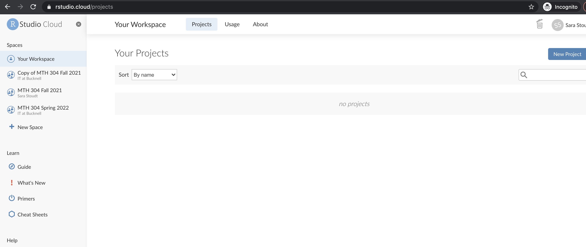
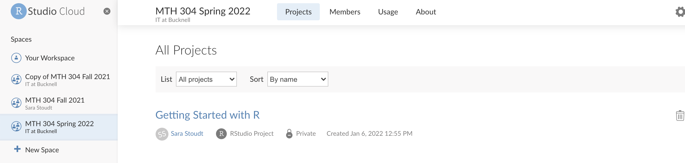
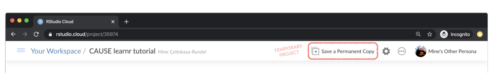
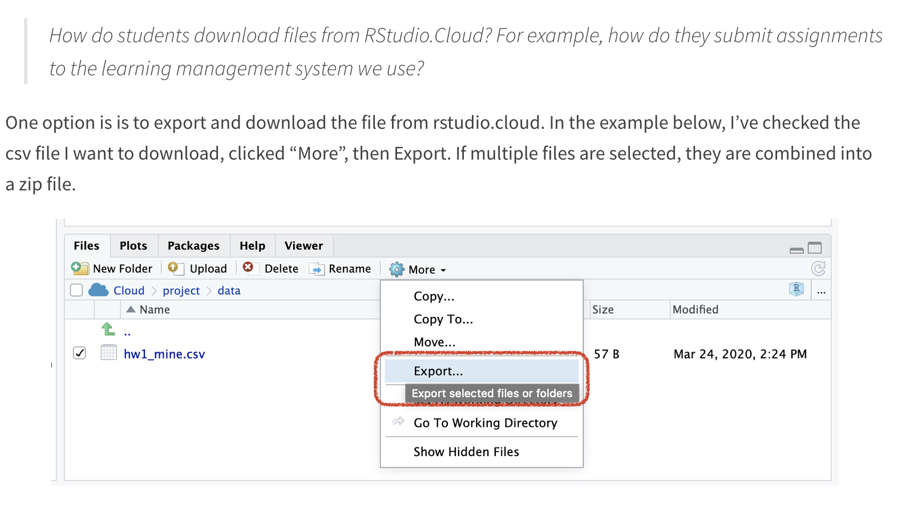
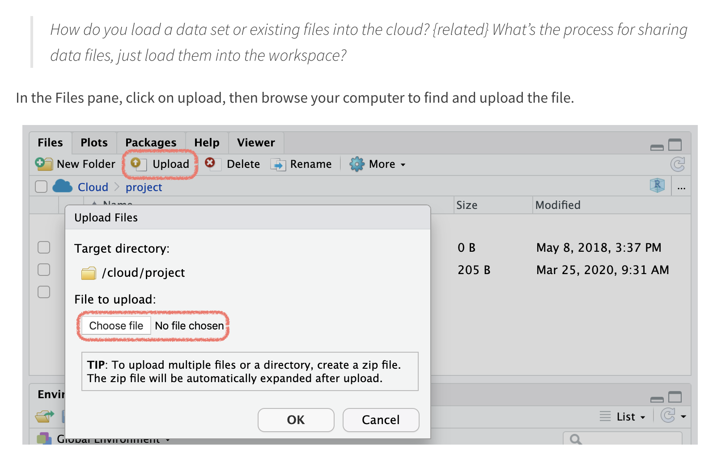
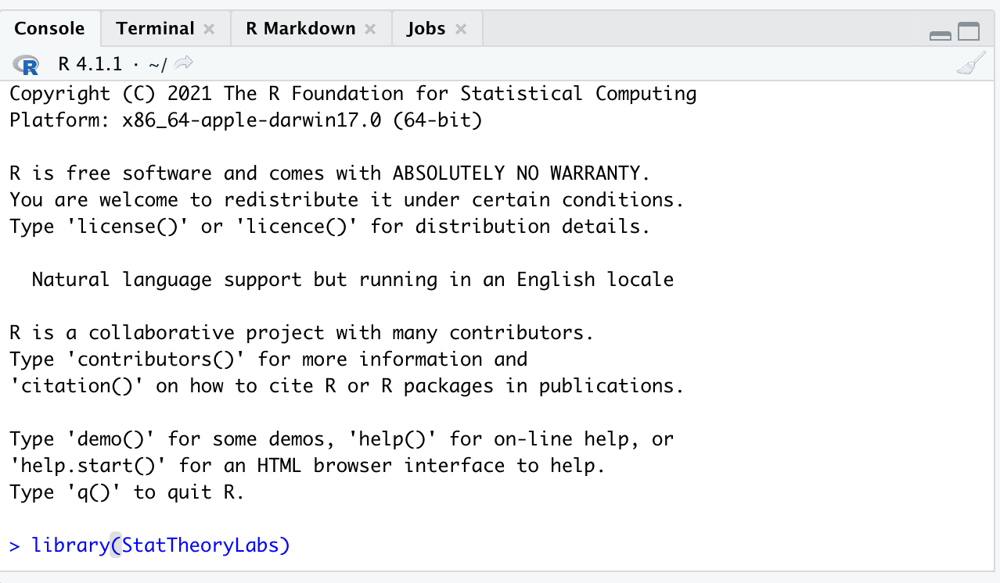
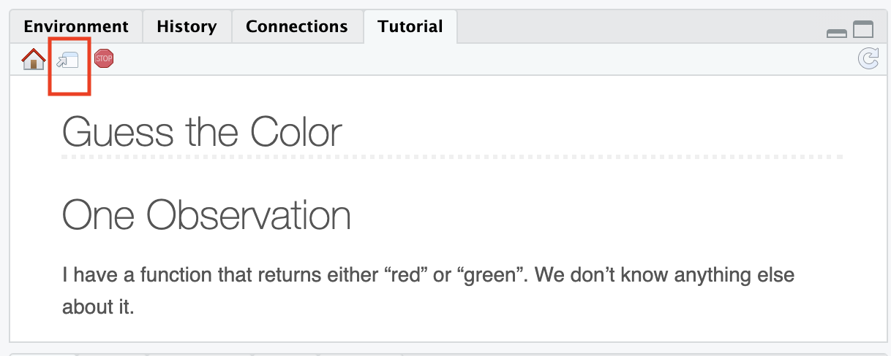

```{r, include = FALSE}
knitr::opts_chunk$set(
  collapse = TRUE,
  comment = "#>"
)
```

```{r setup}
library(StatTheoryLabs)
```

## R Studio Cloud

We will be using R and RStudio in this class for some homework questions, labs, and the final project. R is a statistical software used by many data professionals to wrangle, visualize, and analyze data. RStudio is the interface for interacting with the software.

We have access to RStudio via a cloud service. This means that you do not need to install any software on your personal device. Instead, you can access this software via a browser using your Bucknell credentials.

**Task**: Go to [https://rstudio.bucknell.edu](https://rstudio.bucknell.edu) and log in.

## Cloud Workspace

Once you are logged in you should see something like this:



I have invited you to a workspace for this class ("MTH 304 Spring 2022") that should have one project in it ("Getting Started with R"). Each project is a pre-made environment that has relevant materials in it.

.

You can also access this workspace via [this link](https://sso.rstudio.cloud/bucknell-university?redirect=https%3A%2F%2Frstudio.cloud%2Fspaces%2F205242%2Fjoin%3Faccess_code%3Dt%252Ffr9xIQjo%252BlA16VANIh3xD8eX0nCPwi2U7%252BqJVr).

**Task**: When you click on the project, you will need to create your own copy of the project so that you can permanently store your work. This is important, else when you leave this webpage, your progress will not be saved.



## RStudio Orientation

**Task**: To understand the layout that you should now see, read 1.3 [here](https://intro2r.com/rstudio_orient.html).

## Exporting Files From the Server

For things like labs and project checkpoints you will need to export files from the R server to your personal computer so that you can turn in the files on Moodle. To do this, put a check mark by the file names that you want to download (in the bottom right panel). Click the "More" button and then choose "Export". This will cause a zip file to be dowloaded to your computer. You can unzip this folder (double click on it) to retrieve your documents. 



**Task**: Export the `r_rollercoaster.png` file made by Allison Horst and upload it to Moodle under the Code Training 1 Assignment. 

## Importing Files to the Server 

If you have a file on your personal computer (like a dataset) that you want to have access to in your RStudio project, you can import it.



**Task**: Import the `debugging.jpeg` file made by Allison Horst (found on Moodle under the Code Training 1 Assignment. Take a screenshot showing that it successfully appears in the File pane, and upload this screenshot to Moodle under the Code Training 1 Assignment. 

## Packages

In R, some functionality lives in "packages" of code that other people have developed and shared. We need to install packages so they are available in our R environment only once. I have installed the packages that you will need. You can check to see which packages (and which versions) are installed by inspecting the *Packages* tab in the lower right panel of RStudio. 

To use the functionality in a given session, we need to load the package by using the `library` command. 

**Task**: Load the package that has the tutorials in it by typing `library(StatTheoryLabs)`into the console and then pressing the "enter" or "return" key.



## Interactive Tutorials

The coding trainings will often take the form of an interactive tutorial that will step you through new code and ask you to fill in exercises. These tutorials can give you automated feedback and are meant to help you as you independently build up your coding skills.

**Task**: To learn about how these work, access (and complete) the first tutorial by typing `run_tutorial("ct-1", "StatTheoryLabs")`into the console and then pressing the "enter" or "return" key. 

A pop-up window should appear. If it does not, you may have a pop-up blocker issue:


or you need to expand the tutorial window (upper right hand corner of RStudio window):




## Resources for learning R and working in RStudio

That was a short introduction to R and RStudio, but I will provide you with more functions and a more complete sense of the language as the course progresses. 

In this course we will be using the suite of R packages from the **tidyverse**. 
The book [R For Data Science](https://r4ds.had.co.nz/) by Grolemund and Wickham is a fantastic resource for data analysis in R with the tidyverse. 
If you are googling for R code, make sure to also include these package names in your search query. For example, instead of googling "scatterplot in R", google "scatterplot in R with the tidyverse".

These cheatsheets may come in handy throughout the semester:

- [RMarkdown cheatsheet](https://github.com/rstudio/cheatsheets/raw/master/rmarkdown-2.0.pdf)
- [Data transformation cheatsheet](https://github.com/rstudio/cheatsheets/raw/master/data-transformation.pdf)
- [Data visualization cheatsheet](https://github.com/rstudio/cheatsheets/raw/master/data-visualization-2.1.pdf)

Note that some of the code on these cheatsheets may be too advanced for this course. However the majority of it will become useful throughout the semester.

If you run into a problem, [Google it!](https://ucsb-meds.github.io/teach-me-how-to-google/). I do this all the time, even after being an R coder for about 10 years now.

Note: some screenshots from [Mine's matrials](https://education.rstudio.com/blog/2020/04/teaching-with-rstudio-cloud-q-a/)